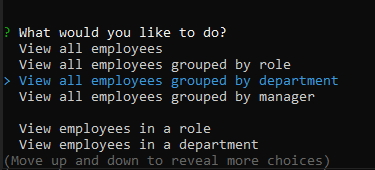
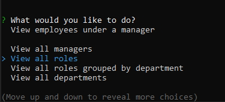
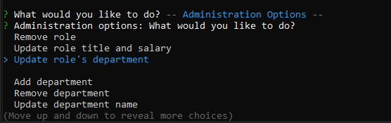

# Employee Management Interface
[](https://opensource.org/licenses/ISC)

## Description
A node based CLI to manage an organization employee database, including heirarchy for employee / manager relationships

## Table of Contents

1. [Installation](#1-installation)
2. [Usage](#2-usage)
3. [License](#3-license)
4. [Contributing](#4-contributing)
5. [Tests](#5-tests)
6. [Questions](#6-questions)

## 1 Installation
1. Download repository
```
https://github.com/Zarlengo/Employee-Tracker
```

2. Install dependencies
```
npm install
```

## 2 Usage


Menu options
* [View all employees](#view-all-employees)
* [View all employees grouped by role](#view-all-employees-grouped-by-role)
* [View all employees grouped by department](#view-all-employees-grouped-by-department)
* [View all employees grouped by manager](#view-all-employees-grouped-by-manager)
* [View employees in a role](#view-employees-in-a-role)
* [View employees in a department](#view-employees-in-a-department)
* [View employees under a manager](#view-employees-under-a-manager)
* [View all managers](#view-all-managers)
* [View all roles](#view-all-roles)
* [View all roles grouped by department](#view-all-roles-grouped-by-department)
* [View all departments](#view-all-departments)
* [View total utilized budget by department](#view-total-utilized-budget-by-department)
* [View total utilized budget by manager](#view-total-utilized-budget-by-manager)
* [Add employee](#add-employee)
* [Remove employee](#remove-employee)
* [Update employee name](#update-employee-name)
* [Update employee role](#update-employee-role)
* [Update employee manager](#update-employee-manager)

Administration Menu Options


* [Add role](#add-role)
* [Remove role](#remove-role)
* [Update role title and salary](#update-role-title-and-salary)
* [Update role's department](#update-roles-department)
* [Add department](#add-department)
* [Remove department](#remove-department)
* [Update department name](#update-department-name)

***
#### View all employees


Shows all employees within the company in order alphabetically by last name

***
#### View all employees grouped by role


Shows all employees within the company split out by their role

***
#### View all employees grouped by department


Shows all employees within the company split out by department

***
#### View all employees grouped by manager


Shows all employees within the company split out by direct manager

***
#### View employees in a role


Shows all employees who are in a specific role

***
#### View employees in a department


Shows all employees who are in a specific department

***
#### View employees under a manager


Shows all employees who are direct reports for a specific manager

***
#### View all managers


Shows all managers within the company

***
#### View all roles


Shows all roles available within the company in order alphabetically by department

***
#### View all roles grouped by department


Shows all roles grouped by which department they belong

***
#### View all departments


Shows all departments available within the company

***
#### View total utilized budget by department


Shows the total utilized budget for each department

***
#### View total utilized budget by manager


Shows the total utilized budget for each manager

***
#### Add employee


Allows adding an employee to the database

***
#### Remove employee


Allows the removal of an employee from the database


```diff
- Employees can only be removed if they are not currently a manager
```

***
#### Update employee name


Allows the updating of an employee's name. Current name shows as default and will be utilized if hitting return without including an entry

***
#### Update employee role


Allows the updating of an employee's role

***
#### Update employee manager


Allows the updating of an employees manager

***
#### Add role


Allows adding a role to the database

***
#### Remove role


Allows the removal of a role from the database


```diff
- Roles can only be removed if they do not currently belong to an employee
```

***
#### Update role title and salary


Allows the updating of a role's title and/or salary. Current title and salary shows as default and will be utilized if hitting return without including an entry

***
#### Update role's department


Allows updating which department the role belongs

***
#### Add department


Allows the adding of a department

***
#### Remove department


Allows the removal of a department


```diff
- Departments can only be removed if they do not currently belong to a role
```

***
#### Update department name


Allows updating of a departments name. Current name shows as default and will be utilized if hitting return without including an entry

***


## 3 License
    Copyright © 2020 Chris Zarlengo
    Permission to use, copy, modify, and/or distribute this software for any
    purpose with or without fee is hereby granted, provided that the above
    copyright notice and this permission notice appear in all copies.

    THE SOFTWARE IS PROVIDED "AS IS" AND THE AUTHOR DISCLAIMS ALL WARRANTIES
    WITH REGARD TO THIS SOFTWARE INCLUDING ALL IMPLIED WARRANTIES OF
    MERCHANTABILITY AND FITNESS. IN NO EVENT SHALL THE AUTHOR BE LIABLE FOR ANY
    SPECIAL, DIRECT, INDIRECT, OR CONSEQUENTIAL DAMAGES OR ANY DAMAGES
    WHATSOEVER RESULTING FROM LOSS OF USE, DATA OR PROFITS, WHETHER IN AN ACTION
    OF CONTRACT, NEGLIGENCE OR OTHER TORTIOUS ACTION, ARISING OUT OF OR IN
    CONNECTION WITH THE USE OR PERFORMANCE OF THIS SOFTWARE.

## 4 Contributing
* [Zarlengo](https://github.com/Zarlengo)


## 5 Tests
1. Test stuff

## 6 Questions
* [Github Profile for Zarlengo](https://github.com/Zarlengo)
* [Send email to christopher@zarlengo.net](mailto:christopher@zarlengo.net)
* [File an issue](https://github.com/Zarlengo/Employee-Tracker/issues)
